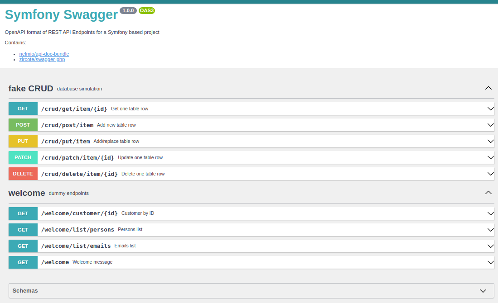

# Swagger Symfony
Example of generating documentation for REST API endpoints based on the OpenAPI format. Controller methods are described using attributes.

### Composer required
- nelmio/api-doc-bundle
- zircote/swagger-php

### Endpoint description
```php
#[Get(
    path: '/welcome',
    description: 'Default response from new Controller method with JsonResponse',
    summary: 'Welcome message',
    tags: ['welcome'],
    responses: [
        new Response(
            response: 200,
            description: 'Keys "message" and "path"',
            content: [
                new JsonContent(ref: '#/components/schemas/JsonDefault')
            ]
        ),
        new Response(response: 400, description: 'Bad Request'),
        new Response(response: 404, description: 'Not found'),
    ]
)]
```

### Screenshot
